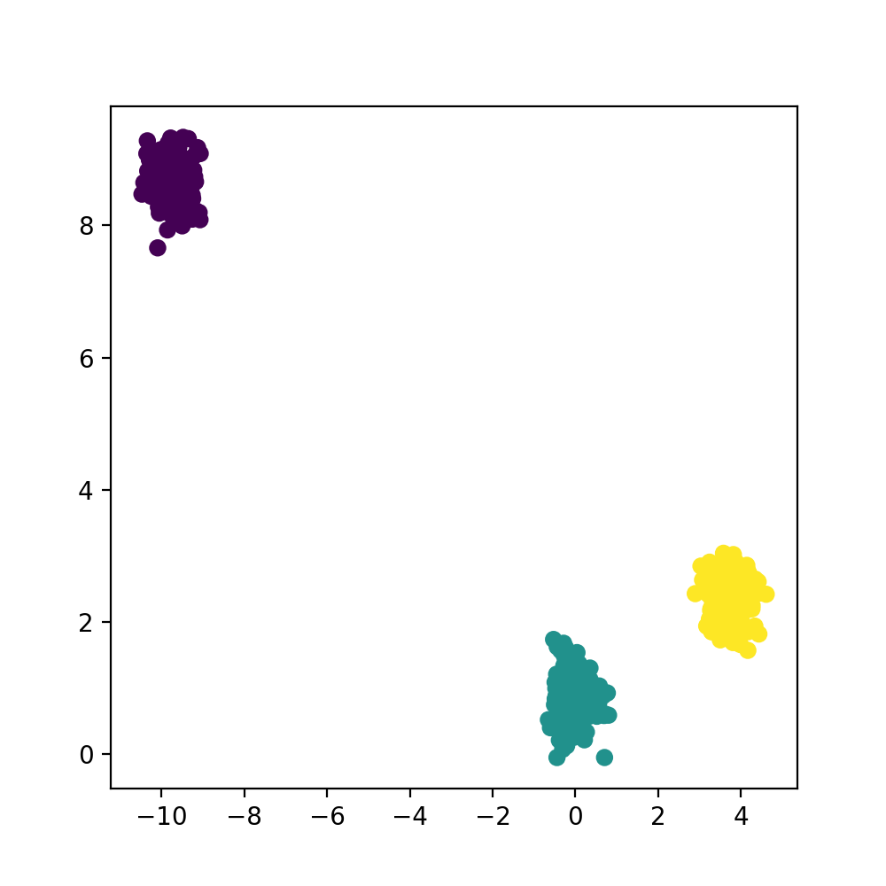
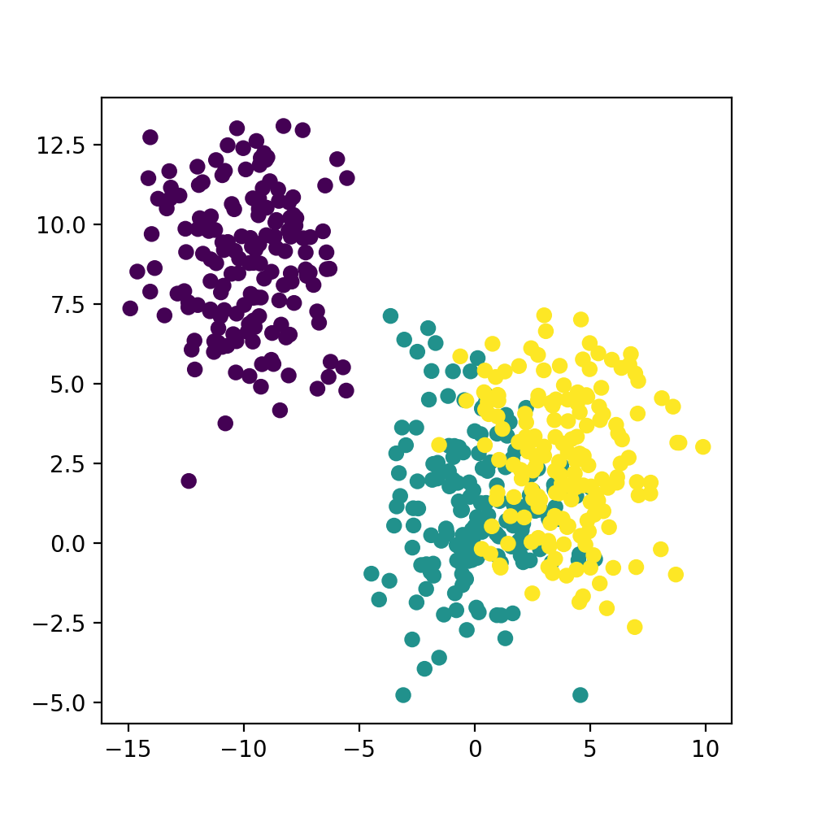

# Assignment 3: Implementation of Kmeans from Scratch


## Assignment Overview: 

In class, you learned that K-means clustering is an unsupervised machine learning method that "clusters" a dataset into groups based on distance. 

This centroid is a datapoint that represents the center of the cluster (the mean). The algorithm works in a way where it iterative proccess until each data point is closer to its own cluster's centroid than any other centroid.

K-means starts its process when you arbitraily select a number of centroids. For example: 

1) I will first choose to have 3 "k" (k == centroid)
2) Algorithm will initiate 3 centroids 
3) Algorithm will assign every data point in the dataset to the nearest centroid (E-Step)
4) Algorithm will recompute centroid by taking average of all points in the cluster, then trying to reduce variance of the data points (M-Step)
5) Algorithm will re-assign the data points to the nearest centroid 
6) Repeat until it reaches the number of steps you've specified


## Starting the Assignment

Steps: 

1. Fork this repo and clone the fork
2. Create a conda environment from the requirements.txt file 
* TODO: 
3. 


## Example Visualizations
Here are some examples of visualizations for some tightly and loosely clustered data.

### Tightly Clustered Data


### Loosely Clustered Data



# `_euclidean` method
Before writing your other methods, you should first solve your euclidean method. Recall the general distance formula:
```python3
distance = sqrt([y2 - y1]^2 + [x2 - x1]^2)
```
Using this as your guide, return the `distance` in this function.

# Creating your clusters (`fit`)
A centroid is a data point that represents the center of the cluster. Recall that we must first start with initializing the centroid. How do we do that? We need to assign the center of the centroid to start at a random point given our X matrix.

```python3
# Pick K indices from range [0, n).
n = data.shape[0]
rand_indices = np.random.randint(0, n, k)
```

From slide 15 of Week 5, we learned that we obtain the centroids by iteratively reassigning points to clusters and update centroids to reduce cluster
spread. After initializing our centroid, we have to assign clusters:

```python3
Hint:
distances = the euclidean distance between the data and centroids

closest_cluster = np.argmin(distances, axis=1)
```
`closest_cluster` is a 1-D matrix of the clusters that give the smallest euclidean distance. After assigning each data point to a cluster, the centroids are recalculated as the mean of all data points within each cluster.

```
new_centroid = for each cluster, calculate the mean of the points in the cluster
```
Note that `distances`, `closest_cluster`, and `new_centroid` will have to keep looping until it stabilizes within the specified tolerance (`tol`)

# PLEASE TRY NOT TO USE CHATGPT. ONLY USE IF YOU HAVE EXHAUSTED ALL YOUR OPTIONS.

